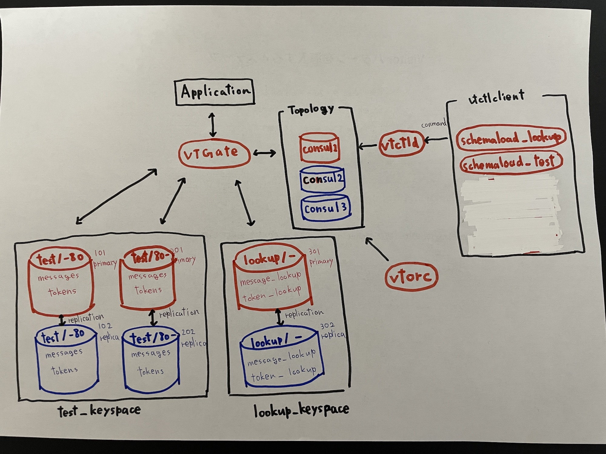

# Vitess Examples

This repository contains an example for using Vitess, e.g. configuration files, Docker Compose files.

### Docker Compose

For getting started please check the [docker compose example](./compose).

